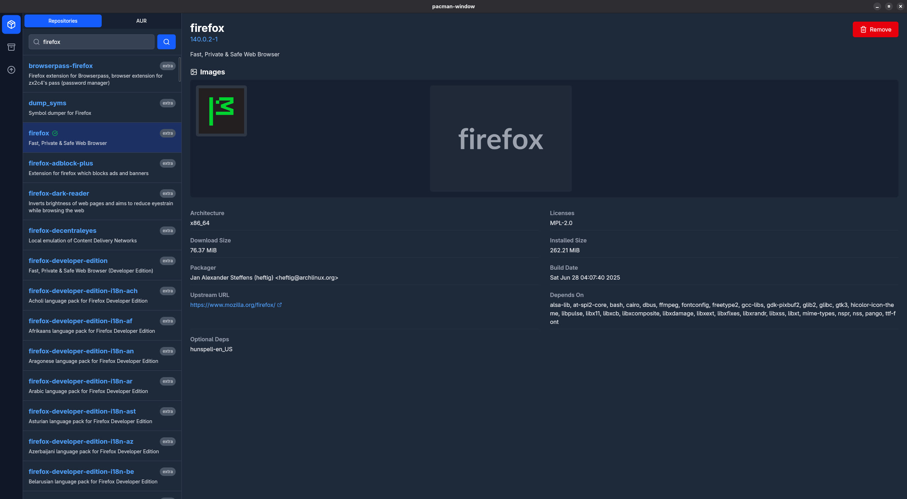
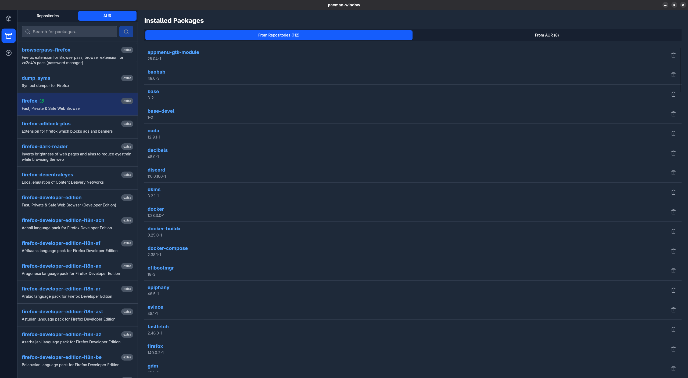
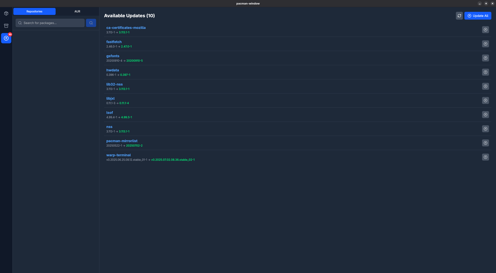
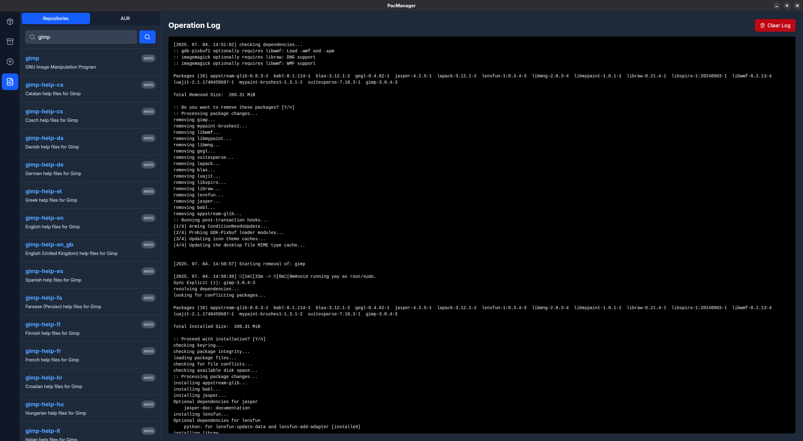

# GUI Package Manager for Arch Linux (and derivatives)

This application provides a user-friendly graphical interface for managing both official Arch Linux packages via pacman and AUR (Arch User Repository) packages via yay.

It simplifies the process of:

- Searching for packages: Quickly find the software you need.

- Installing new packages: Effortlessly add applications to your system.

- Updating existing packages: Keep your system up-to-date with the latest software.

- Removing unwanted packages: Easily uninstall applications you no longer need.

- Managing dependencies: Handles package dependencies automatically for a smoother experience.

- This tool aims to make package management on Arch-based distributions more accessible and intuitive for users of all experience levels.

